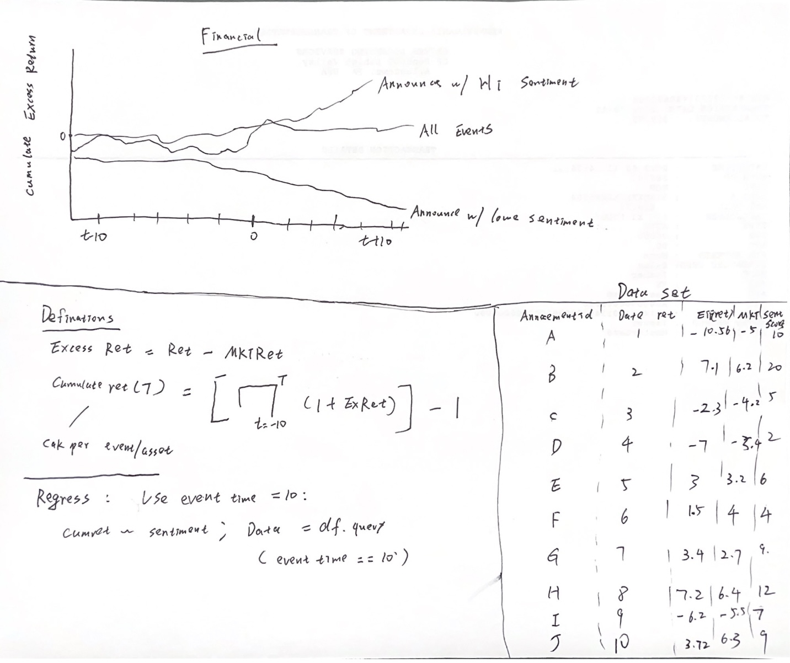
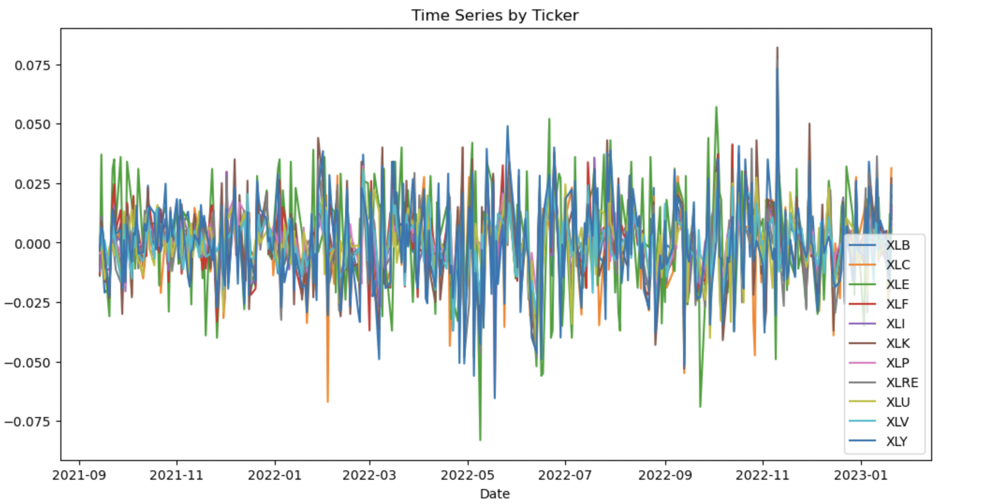
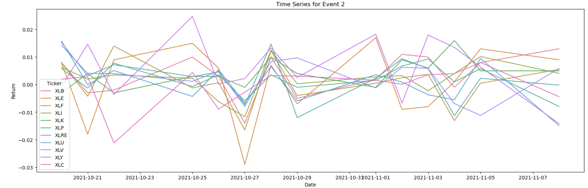
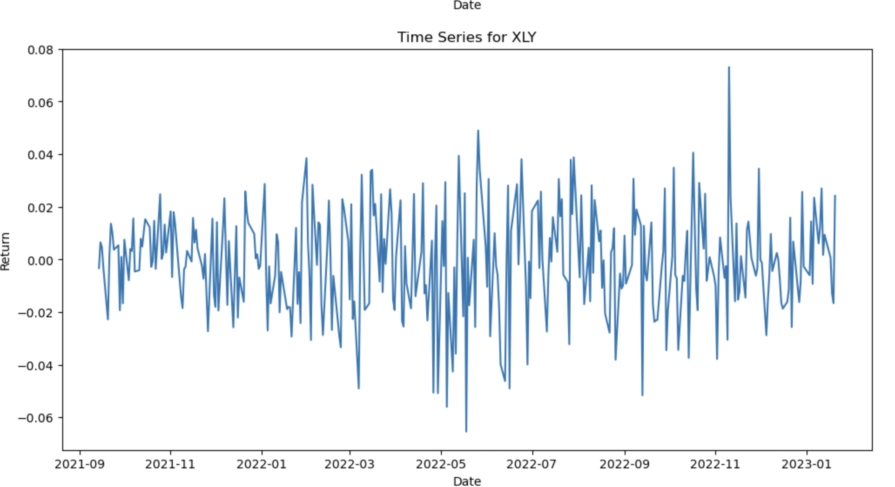
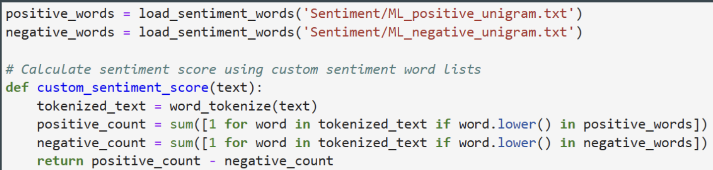
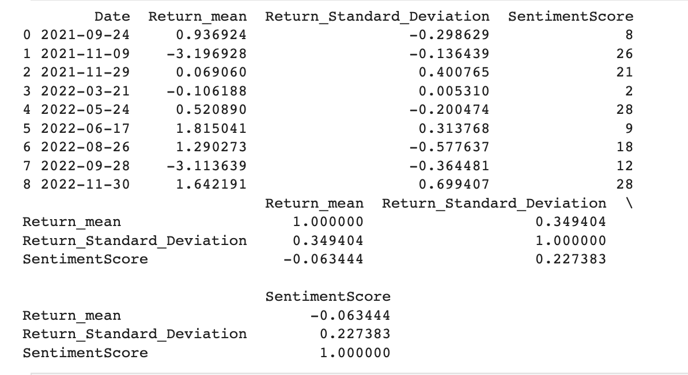
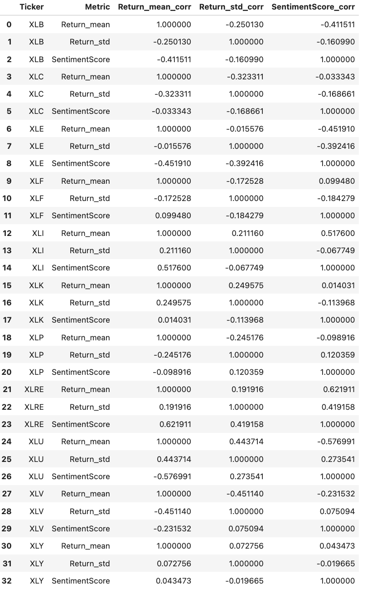
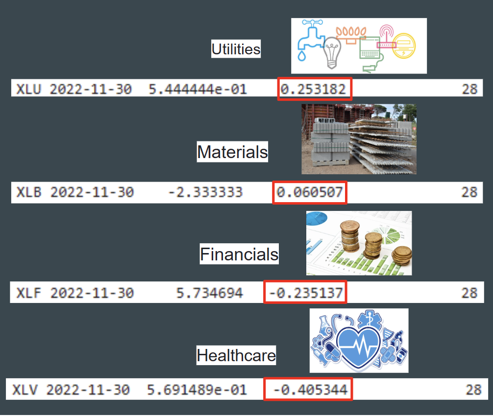

# Welcome to our team project website!
<a href="[https://docs.google.com/presentation/d/1YXygd4gBerj14SOamKhkprre9bx5oJdjxJ6GZWQTzq8/edit]">Sentiment Analysis of Federal Reserve Announcements and its Impact on the Sector ETFs</a> 

## Table of contents
1. [Introduction](#introduction)
2. [Methodology](#meth)
3. [ETF Tickers](#etftickers)
4. [Analysis Section](#analysissection)
    - [Visulizations](#Visulizations)
    - [Sentiment Scores](#sentimentscores)
    - [Analysis](#analysis)
5. [Finding](#finding)
6. [Summary](#summary)
7. [About the team](#about)
8. [Additional Resource](#additional)

## Introduction  <a name="introduction"></a>
The main goal of this project is to see how Federal Reserve announcements impact the stock market in recent 2 years.

### Research Question:
How do Federal Reserve announcements influence the stock market according to Natural language processing, particularly the ETFs across various sectors?

### Specific research question:
- What is the overall sentiment and intensity in the each announcements?
- How do these sentiment scores correlate with subsequent stock market movements for the sector ETFs?
- Can we predict stock market reactions based on the sentiment derived from announcements?


### Our Hypotheses:
- Positive sentiment score in announcements leads to a positive stock market reaction.
- Negative sentiment score in announcements leads to a negative stock market reaction.

### Predictions:
According to the hypotheses above, we believe that every time when the Federal Reserve announcements related to a piece of good news are released, the stock of companies will show a good trend and vice versa. Whether it has a piece of good news is determined by the sentiment score that we measure.

 


## Methodology <a name="meth"></a>

In this project, we perform sentiment analysis on the Federal Reserve announcements using natural language processing to obtain sentiment scores. Before that, we select 10 Federal Reserve announcements given by chair Powell. We then merge these sentiment scores with the corresponding stock and ETF returns to analyze the correlation between the sentiment scores and stock market movements. This analysis allows us to gain insights into the influence of Federal Reserve announcements on the stock market, particularly the ETFs across various sectors.

### Notebook
There are 3 Jupyter lab notebook available in this repo.
- <a href="https://github.com/SikaiWang224/teamproject-/blob/main/visualization.ipynb">visualization.ipynb</a>  
- <a href="https://github.com/SikaiWang224/teamproject-/blob/main/Sentiment Analysis.ipynb">Sentiment Analysis.ipynb</a>  
- <a href="https://github.com/SikaiWang224/teamproject-/blob/main/Analysis.ipynb">Analysis.ipynb</a>  


### How does the dataframe look like


### Event_dates
We regard 10 days before the event date and 10 days after the event date with its annoucement date into one period. We have totally 10 periods reprsenting for 10 annoucement event. 
```python
window = 10
event_dates = ['2021-09-24', '2021-11-09', '2021-11-29', '2022-03-21', '2022-05-24', '2022-06-17', '2022-08-26', '2022-09-28', '2022-11-30', '2023-01-11']
event_dates = [pd.Timestamp(date) for date in event_dates]
returns['Date'] = pd.to_datetime(returns['Date'])

for event_date in event_dates:
    before_event = returns[returns['Date'] < event_date].tail(window)
    after_event = returns[returns['Date'] > event_date].head(window)

    mean_before = before_event['Return'].mean()
    std_before = before_event['Return'].std()
    mean_after = after_event['Return'].mean()
    std_after = after_event['Return'].std()

    return_mean = (mean_before-mean_after)/mean_before
    return_std = (std_before-std_after)/std_before
    announce_date.loc[announce_date['Date'] == event_date, 'Return_mean'] = return_mean
    announce_date.loc[announce_date['Date'] == event_date, 'Return_Standard_Deviation'] = return_std
    sentiment_score_df['Date'] = pd.to_datetime(sentiment_score_df['Date'])
    merged_df = pd.merge(announce_date, sentiment_score_df, on='Date')
    print(merged_df)
    corr_matrix = merged_df[['Return_mean', 'Return_Standard_Deviation', 'SentimentScore']].corr()
    print(corr_matrix)
```


## ETF Tickers <a name="etftickers"></a>


- Financials: Financial Select Sector SPDR Fund (XLF)
- Technology: Technology Select Sector SPDR Fund (XLK)
- Healthcare: Health Care Select Sector SPDR Fund (XLV)
- Consumer Discretionary: Consumer Discretionary Select Sector SPDR Fund (XLY)
- Consumer Staples: Consumer Staples Select Sector SPDR Fund (XLP)
- Industrials: Industrial Select Sector SPDR Fund (XLI)
- Energy: Energy Select Sector SPDR Fund (XLE)
- Materials: Materials Select Sector SPDR Fund (XLB)
- Utilities: Utilities Select Sector SPDR Fund (XLU)
- Real Estate: Real Estate Select Sector SPDR Fund (XLRE)
- Communication Services: Communication Services Select Sector SPDR Fund (XLC)

## Analysis Section <a name="analysissection"></a>

###  Visulizations <a name="Visulizations"></a>
The visualizations in this project showcase the relationships between sentiment scores and stock market movements. We provide a series of graphs that help illustrate the trends and correlations between sentiment scores derived from the Federal Reserve announcements and the stock and ETF returns. These visualizations serve as a valuable tool in understanding the impact of Federal Reserve announcements on the stock market.
[More details are provided in the notebook](visualization.ipynb).


<br><br>
<br><br>

<br><br>
<br><br>

<br><br>


### Sentiment scores <a name="sentimentscores"></a>
By analyzing the sentiment score analysis of news articles, social media posts, and other textual data, traders and investors can identify emerging trends, gauge market sentiment, and make more informed investment decisions. Sentiment score analysis is one of the many tools used in fundamental analysis, which involves analyzing the underlying financial and economic factors that affect the stock market.
[More details are provided in the notebook](Sentiment Analysis.ipynb).




### Analysis <a name="analysis"></a>
Our analysis involves examining the correlation between the sentiment scores derived from the Federal Reserve announcements and the subsequent stock market movements for the sector ETFs. By identifying the trends in these correlations, we can better understand the impact of Federal Reserve announcements on the stock market and make more informed predictions about stock market reactions based on the sentiment derived from announcements.
[More details are provided in the notebook](Analysis.ipynb).





## Finding  <a name="finding"></a>
- One notable finding in our research is based on the 2022-11-30 Chairman Powell speech announcement. During the announcement, Chairman Powell discussed the possibility of slowing down interest rate hikes as early as the December meeting and considering the duration of maintaining restrictive interest rates to curb inflation.

#### Click the image below to see the Youtube video for Fed Chair Powell speaks at The Brookings Institute on economic outlook — 11/30/22
[](http://www.youtube.com/watch?v=yYUIt6FtIB4 "Federal Reserve Announcement Analysis")
<br>
[Read the full text of the speech here](https://www.federalreserve.gov/newsevents/speech/powell20221130a.htm)
- Our sentiment analysis resulted in a score of 28, indicating that it was a positive announcement. We compared the returns of four different sectors, such as utilities (XLU), materials (XLB), financials (XLF), and healthcare (XLV), during the announcement period. We discovered that the utilities sector had the highest return, while the healthcare sector had the lowest return.


### Result of Sentiment Analysis
- We can conclude that the Federal Reserve announcement has benefited the utilities sector while causing harm to the healthcare sector. The slowing down of interest rate hikes can benefit the utilities sector (XLU) as these companies typically have high levels of debt due to the capital-intensive nature of their business. A slower pace of rate hikes means lower borrowing costs, which can boost their profitability and cash flows. Conversely, the healthcare sector (XLV) may be negatively impacted by the slower pace of rate hikes, as it could lead to higher inflationary pressures that may increase operational costs and erode profit margins for healthcare companies. Additionally, as healthcare is a more cyclical sector, it may be more vulnerable to broader economic fluctuations caused by changes in monetary policy.

### Forecast
- The utilities sector (XLU) is expected to benefit from the Federal Reserve's decision to slow down the pace of interest rate hikes. This is because utilities companies tend to have high debt levels due to their capital-intensive operations. As a result, we anticipate the utilities sector to show strength in the coming months.
- On the other hand, the healthcare sector (XLV) may face challenges due to the slowing down of interest rate hikes. The reduced pace of rate hikes could result in higher inflationary pressures, which can increase operational costs and negatively impact profit margins for healthcare companies. Therefore, we predict the healthcare sector to experience increased volatility and potentially underperform in the near term.


## Summary <a name="summary"></a>

Overall, this final project  involves the use of machine learning algorithms to analyze news articles, social media posts and other text data to determine the sentiment of market participants regarding Fed announcements. Sentiment score analysis assigns a score to each text segment based on its positive, negative or neutral sentiment.

Also,The impact on sector etfs is analyzed by examining the price movements of etfs focused on specific economic sectors (e.g., technology, health care or energy) following the Fed announcement. The purpose of the analysis is to determine whether market participants' sentiment toward the announcement is positively or negatively correlated with the price movement of sector etfs. Finally,the sentiment analysis results of Fed announcements and their subsequent impact on sector etfs can provide valuable insights for traders and investors to make informed investment decisions. By understanding market participants' sentiment towards the Fed announcement and its impact on sector etfs, traders and investors can adjust their investment strategies and manage their exposures accordingly


## About the team <a name="about"></a>


<br>
Sz-Je Wang is a highly motivated Finance and Business Analytics major with a FinTech minor at Lehigh University, expecting to graduate in May 2024. My academic journey has been fueled by a strong passion for understanding the intricacies of financial markets. 
<br>

<br>
Sz-An Wang is a student at UCI majoring 
